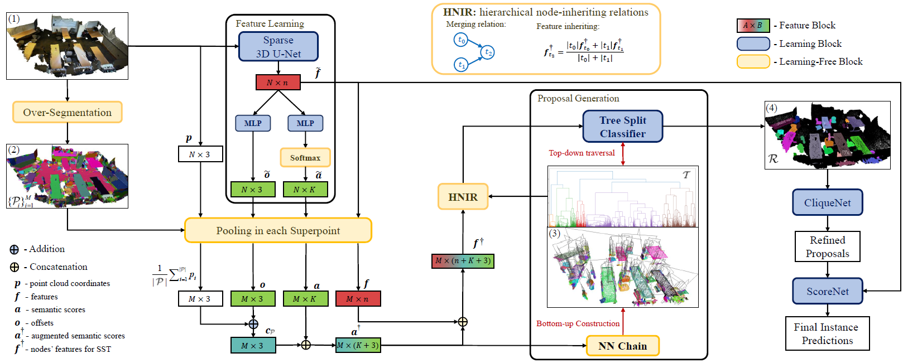

# SSTNet

[](https://paperswithcode.com/sota/3d-instance-segmentation-on-scannetv2?p=instance-segmentation-in-3d-scenes-using)
[](https://paperswithcode.com/sota/3d-instance-segmentation-on-s3dis?p=instance-segmentation-in-3d-scenes-using)


**Instance Segmentation in 3D Scenes using Semantic Superpoint Tree Networks(ICCV2021)**
by Zhihao Liang, Zhihao Li, Songcen Xu, Mingkui Tan, Kui Jia*. (\*) Corresponding author.
[[arxiv]](https://arxiv.org/abs/2108.07478)


## Introduction
Instance segmentation in 3D scenes is fundamental in many applications of scene understanding. It is yet challenging due to the compound factors of data irregularity and uncertainty in the numbers of instances. State-of-the-art methods largely rely on a general pipeline that first learns point-wise features discriminative at semantic and instance levels, followed by a separate step of point grouping for proposing object instances. While promising, they have the shortcomings that (1) the second step is not supervised by the main objective of instance segmentation, and (2) their point-wise feature learning and grouping are less effective to deal with data irregularities, possibly resulting in fragmented segmentations. To address these issues, we propose in this work an end-to-end solution of Semantic Superpoint Tree Network (SSTNet) for proposing object instances from scene points. Key in SSTNet is an intermediate, semantic superpoint tree (SST), which is constructed based on the learned semantic features of superpoints, and which will be traversed and split at intermediate tree nodes for proposals of object instances. We also design in SSTNet a refinement module, termed CliqueNet, to prune superpoints that may be wrongly grouped into instance proposals.

## Installation

### Requirements
* Python 3.8.5
* Pytorch 1.7.1
* torchvision 0.8.2
* CUDA 11.1  

then install the requirements:
```sh
pip install -r requirements.txt
```

### SparseConv
For the SparseConv, please refer [PointGroup's spconv](https://github.com/llijiang/spconv) to install.

### Extension
This project is based on our Gorilla-Lab deep learning toolkit - `gorilla-core` and 3D toolkit `gorilla-3d`.

For `gorilla-core`, you can install it by running:
```sh
pip install gorilla-core==0.2.7.6
```
or building from source(recommend)
```sh
git clone https://github.com/Gorilla-Lab-SCUT/gorilla-core
cd gorilla-core
python setup.py install(develop)
```

For `gorilla-3d`, you should install it by building from source:
```sh
git clone https://github.com/Gorilla-Lab-SCUT/gorilla-3d
cd gorilla-3d
python setup.py develop
```
> Tip: for high-version `torch`, the `BuildExtension` may fail by using ninja to build the compile system. If you meet this problem, you can change the `BuildExtension` in `cmdclass={"build_ext": BuildExtension}` as `cmdclass={"build_ext": BuildExtension}.with_options(use_ninja=False)`

Otherwise, this project also need other extension, we use the `pointgroup_ops` to realize voxelization and use the `segmentator` to generate superpoints for scannet scene. we use the `htree` to construct the **Semantic Superpoint Tree** and the **hierarchical node-inheriting relations** is realized based on the modified `cluster.hierarchy.linkage` function from `scipy`.    

- For `pointgroup_ops`, we modified the package from `PointGroup` to let its function calls get rid of the dependence on absolute paths. You can install it by running:
    ```sh
    conda install -c bioconda google-sparsehash 
    cd $PROJECT_ROOT$
    cd sstnet/lib/pointgroup_ops
    python setup.py develop
    ```
    Then, you can call the function like:
    ```python
    import pointgroup_ops
    pointgroup_ops.voxelization
    >>> <function Voxelization.apply>
    ```
- For `htree`, it can be seen as a supplement to the `treelib` python package, and I abstract the **SST** through both of them. You can install it by running:
    ```sh
    cd $PROJECT_ROOT$
    cd sstnet/lib/htree
    python setup.py install
    ```
    > Tip: The interaction between this piece of code and `treelib` is a bit messy. I lack time to organize it, which may cause some difficulties for someone in understanding. I am sorry for this. At the same time, I also welcome people to improve it. 
- For `cluster`, it is originally a sub-module in `scipy`, the `SST` construction requires the `cluster.hierarchy.linkage` to be implemented. However, the origin implementation do not consider the sizes of clustering nodes (each superpoint contains different number of points). To this end, we modify this function and let it support the property mentioned above. So, for used, you can install it by running:
    ```sh
    cd $PROJECT_ROOT$
    cd sstnet/lib/cluster
    python setup.py install
    ```
- For `segmentator`, please refer [here](https://github.com/Karbo123/segmentator) to install. (We wrap the [segmentator](https://github.com/ScanNet/ScanNet/tree/master/Segmentator) in ScanNet)

## Data Preparation
Please refer to the `README.md` in `data/scannetv2` to realize data preparation.

## Training
```
CUDA_VISIBLE_DEVICES=0 python train.py --config config/default.yaml
```
You can start a tensorboard session by
```
tensorboard --logdir=./log --port=6666
```
> Tip: For the directory of logging, please refer the implementation of function `gorilla.collect_logger`.

## Inference and Evaluation
```
CUDA_VISIBLE_DEVICES=0 python test.py --config config/default.yaml --pretrain pretrain.pth --eval
```
- `--split` is the evaluation split of dataset.
- `--save` is the action to save instance segmentation results.
- `--eval` is the action to evaluate the segmentation results.
- `--semantic` is the action to evaluate semantic segmentation only (work on the `--eval` mode).
- `--log-file` is to define the logging file to save evaluation result (default please to refer the `gorilla.collect_logger`).
- `--visual` is the action to save visualization of instance segmentation. (It will be mentioned in the next partion.)

## Results on ScanNet Benchmark
Rank 1st on the ScanNet benchmark


## Pretrained
We provide a pretrained model trained on ScanNet(v2) dataset.
[[Google Drive]](https://drive.google.com/file/d/1UYT5QOjQQYB8QFzZi4cNyncCPNTSVDnu/view?usp=sharing) [[Baidu Cloud]](https://pan.baidu.com/s/19tNxhwO5UkGn7C3E8asMsQ) (提取码：f3az)
Its performance on ScanNet(v2) validation set is 49.4/64.9/74.4 in terms of mAP/mAP50/mAP25.

## Acknowledgement
This repo is built upon several repos, e.g., [PointGroup](https://github.com/dvlab-research/PointGroupt), [spconv](https://github.com/traveller59/spconv) and [ScanNet](https://github.com/ScanNet/ScanNet). 


## Contact
If you have any questions or suggestions about this repo or paper, please feel free to contact me in issue or email (eezhihaoliang@mail.scut.edu.cn).

## TODO
- [ ] Distributed training(not verification)
- [ ] Batch inference
- [x] Multi-processing for getting superpoints

## Citation
If you find this work useful in your research, please cite:
```
@misc{liang2021instance,
      title={Instance Segmentation in 3D Scenes using Semantic Superpoint Tree Networks}, 
      author={Zhihao Liang and Zhihao Li and Songcen Xu and Mingkui Tan and Kui Jia},
      year={2021},
      eprint={2108.07478},
      archivePrefix={arXiv},
      primaryClass={cs.CV}
}
```


